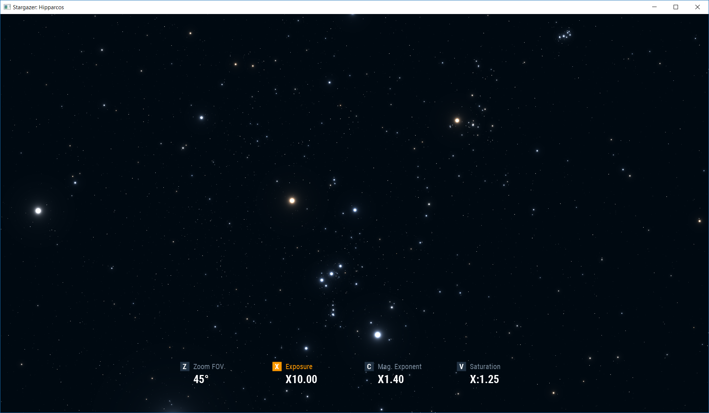
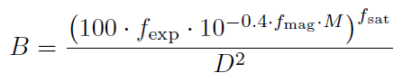

# Stargazer: Hipparcos

Yet another starchart or star viewing app based on the [Hipparcos-2](https://www.cosmos.esa.int/web/hipparcos/hipparcos-2) real star database.
This application displays star positions, magnitudes, and colours. However, it does not show constellation names or planets.

[](https://raw.githubusercontent.com/ashurrafiev/StargazerHipparcos/master/screenshot.png)


## Download

[StargazerHipparcos.zip](https://github.com/ashurrafiev/StargazerHipparcos/releases/download/1.1/StargazerHipparcos.zip) (5.36 MB)

## Why this app?

This project is an experiment.

When using star viewing apps, I noticed that it is very difficult to tune the brightness of displayed stars. The perception also depends on the ambient room
lighting, not just computer display. Many programs provide an option to adjust the brightness of rendered star dots uniformly in proportion with each other. However, if
you increase the brightness proportionally too much, tiny stars start looking just as bright as the main stars, and the shapes of constellations become less clear.

Human perception of the dynamic range is very tricky to simulate on a non-HDR screen. **Stargazer: Hipparcos** allows tuning of
multiple rendering parameters to achieve interesting display effects with various degree of realism.
For example, the screenshot above is showing very high X10 exposure, but the fainter stars remain faint, and the shapes of constellations are still clearly visible.
This is achieved by increasing the exponent of the star magnitude calculation.

The stars are rendered using three adjustable parameters:

* **Exposure** determines the proportional brigtness of the stars.
* **Magnitude Exponent** determines the apparent difference between low magnitude and high magnitude stars (like contrast).
* **Saturation** determines the amount of glow (bloom) around overexposed stars.

The main idea is that each user can individually tune these parameters to satisfy his or her own subjective perception.


## Using Stargazer: Hipparcos

Running the app should be as simple as double clicking the JAR file. If it doesn't work, try running it from the command line:

```
java -jar stargazer.jar
```

Use the mouse to look around.

To adjust a rendering parameter, use **mouse scrool wheel** _while holding down_ a respective hotkey. The hotkeys are: **X** for Exposure,
**C** for Magnitude Exponent, and **V** for Saturation. **Z** hotkey allows changing FOV (vertical field of view angle) to zoom in and out.

Rendering parameters are multipliers, hence they are displayed with `X`. For example, `X2.00` means a parameter is two times larger than the default value,
and `X:2.00` means it is two times smaller.

Pressing **middle mouse button** or **right mouse button** while holding a hotkey will reset the parameter to its default value.

UI display automatically goes away after two seconds of not being used.

For keyboard-only controls, use **arrow keys** to look around and **plus** and **minus** keys while holding a parameter hotkey to change the parameter.
Pressing **backspace** while holding a hotkey will reset the parameter.

**Escape** exits the app, no questions asked.


## Math behind it

We are rendering stars not as single pixels but as "glowing" circles around the centres of the stars. The brightness _B_ of a pixel depending on the star's
apparent magnitude _M_ and the distance _D_ from the star centre is calculated using the following formula:



where _f_<sub>exp</sub> is the Exposure parameter, _f_<sub>mag</sub> is the Magnitude Exponent parameter, and _f_<sub>sat</sub> is the Saturation parameter.

This equation is derived from the calculation of [Luminosity](https://en.wikipedia.org/wiki/Luminosity) from [Bolometric absolute magnitude](https://en.wikipedia.org/wiki/Absolute_magnitude#Bolometric_magnitude). We are interested in the "apparent luminosity" or brightness, hence we
use apparent magnitude instead of absolute magnitude.

The calculation is implemented in [points_v.glsl](https://github.com/ashurrafiev/StargazerHipparcos/blob/master/src/assets/points_v.glsl) and
[points_f.glsl](https://github.com/ashurrafiev/StargazerHipparcos/blob/master/src/assets/points_f.glsl).
